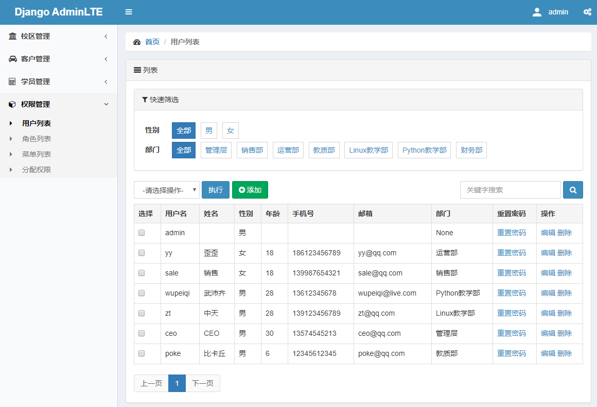
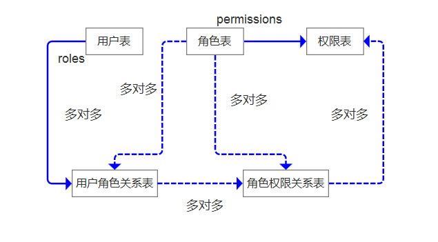
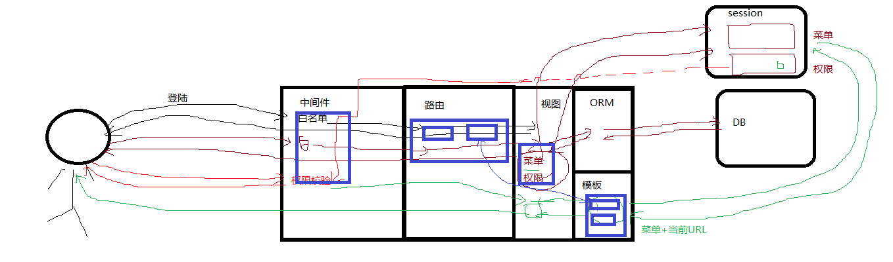

# CRM Demo 开发纪要

CRM，即客户关系管理系统（Customer Relationship Management）。企业用CRM技术来管理与客户之间的关系，以求提升企业成功的管理方式，其目的是协助企业管理销售循环：新客户的招徕、保留旧客户、提供客户服务及进一步提升企业和客户的关系，并运用市场营销工具，提供创新式的个人化的客户商谈和服务，辅以相应的信息系统或信息技术如数据挖掘和数据库营销来协调所有公司与顾客间在销售、营销以及服务上的交互。

为了扩大的系统使用范围，特此将该项目开发改为组件化开发，包括：

- 权限系统，一个独立的Rbac组件。
- Stark组件，一个独立的curd组件。
- CRM业务，以客户关系维护为背景并整合以上两个组件开发一套系统。


## 0. 项目说明

本项目是基于武沛齐老师的《Django开发权限组件及CRM开发》课程代码的基础上，整合了Adminlte2的样式、Python3.6(或以上)、Django2.2版本及MySQL5.7环境，自己重新编写的代码。其中Rbac组件和Stark组件，可以按照本文档的说明，部署应用到其他系统中。

本项目的主要创新点：

- 基于Django2.2的代码改造，其中用户表的创建是基于Django的内置用户体系
- 整合Adminlte2的样式改造，实现与Rbac组件菜单的动态关联

项目试运行环境说明：

- Python3.6(或以上) + Django2.2 + MySQL5.7
- 配置settings.py的数据库参数，在mysql中创建数据库并运行crmdemo_db.sql
- 启动项目，用浏览器访问 http://127.0.0.1:8000/login/

本人是通过网易云课堂学习本视频课程的，非常非常感谢武沛齐老师的精彩讲演与详细解说！下面是本项目的相关视频链接与参考文档：

- 网易云课堂视频：https://study.163.com/course/introduction/1210124829.htm
- 武沛齐老师博客：https://www.cnblogs.com/wupeiqi/articles/9169292.html





## 1. Rbac组件

### 1.1 权限控制设计模式

#### 1.1.1 基本概念

程序开发时的权限控制，对于不同用户使用系统时候就应该有不同的功能。

- 一个人可以有多个角色。
- 一个角色可以有多个人。
- 一个角色可以有多个权限。
- 一个权限可以分配给多个角色。



web程序是通过 url 的切换来查看不同的页面（功能），所以权限指的其实就是URL，对url控制就是对权限的控制。即一个人有多少个权限就取决于他有多少个URL的访问权限。

#### 1.1.2 控制流程




### 1.2 Rbac组件的权限控制

#### 1.2.1 Session

**通过login.html页面，登录系统，获取当前用户所有的权限并写入session**

- apps\web\views\account.py

  ```python
  from django.shortcuts import render, redirect
  from apps.web import models
  from rbac.service.init_permission import init_permission   # rbac组件用户权限初始化
  from django.contrib.auth import login,logout,authenticate
  
  def login_view(request):
      if request.method == 'GET':
          return render(request, 'login.html')
      username = request.POST.get('username')
      password = request.POST.get('password')
      user = authenticate(request,username=username,password=password)
      if user:
          if user.is_active:
              login(request,user)
              user_object = models.UserInfo.objects.filter(username=username).first()
              init_permission(user_object, request)  # 用户权限信息的初始化
              return redirect('/index/')
      if not user:
          return render(request, 'login.html', {'error': '用户名或密码错误'})
  ```

- rbac\service\init_permission.py

  ```python
  from django.conf import settings
  
  def init_permission(current_user,request):
      """
      权限和菜单信息初始化，以后使用时，需要在登陆成功后调用该方法将权限和菜单信息放入session
      """
  	......
      menu_dict = {}  # 菜单字典,它是能成为菜单的权限,用于做菜单显示
      permission_dict = {}  #  权限列表,所有权限,用于做权限校验
  
  	# 获取用户信息和权限信息写入session
      request.session[settings.PERMISSION_SESSION_KEY] = permission_dict
      request.session[settings.MENU_SESSION_KEY] = menu_dict
  ```


#### 1.2.2 Middleware

读取用户权限的session并判断是否有访问权限，没有权限则拒绝访问

- rbac\middleware\rbac.py

  ```python
  from django.utils.deprecation import MiddlewareMixin
  from django.conf import settings
  ......
  
  class RbacMiddleware(MiddlewareMixin):
      """权限控制的中间件"""
  
      def process_request(self, request):
          # 1. 获取当前请求URL
          current_url = request.path_info
  
          # 1.5 白名单处理，无需权限验证即可访问
          for reg in settings.VALID_URL_LIST:
              if re.match(reg,current_url):
                  return None
  
          # 2. 获取当前用户session中所有的权限
          permission_dict = request.session.get(settings.PERMISSION_SESSION_KEY)
  
          # 3. 路径导航列表,首页是必须有的
          request.breadcrumb_list = [
              {'title': '首页', 'url': '/index/'},
          ]
  
          # 此处代码进行判断
          for url in settings.NO_PERMISSION_LIST:
              if re.match(url, request.path_info):
                  # 需要登录，但无需权限校验
                  request.current_menu_id = 0
                  return None
  
          if not permission_dict:
              return HttpResponse('未获取到用户权限信息，请登录！')
  
          # 4. 进行权限校验
          flag = False
          for item in permission_dict.values():
              ......
  
          if not flag:
              return HttpResponse('无权访问')
  ```


#### 1.2.3 TemplateTag

**读取用户可以访问的菜单列表的Session，并通过inclusion_tag显示出来，生成动态菜单与面包屑**

- 自定义模板标签：rbac\templatetags\rbac.py

  ```python
  from django.template import Library
  from django.conf import settings
  from collections import OrderedDict
  from rbac.service import urls
  
  register = Library()
  
  @register.inclusion_tag('rbac/multimenu.html')  # 即rbac\templates\rbac\multimenu.html
  def multimenu(request):
      """生成菜单 """
      # 获取session中的菜单列表
      menu_dict = request.session.get(settings.MENU_SESSION_KEY)
      ordered_dict = OrderedDict()  # 实例化
      for key in sorted(menu_dict):
          # 对字典的key做排序,并添加到有序字典对象中
          ordered_dict[key] = menu_dict[key]
          # 默认所有的一级菜单隐藏
          menu_dict[key]['class'] = 'hide'
          # 循环二级菜单
          for node in menu_dict[key]['children']:
              # 判断当前url的菜单id等于二级菜单id，因为权限表的url能成为菜单的都是二级菜单
              if request.current_menu_id == node['id']:
                  # 增加选中样式,给前端展示
                  node['class'] = 'active'
                  # 点击二级菜单时,让当前所在的一级菜单展示，因为上面，把所有的一级菜单给隐藏了.这里设置为空,表示显示
                  menu_dict[key]['class'] = ''
      return {'menu_dict':ordered_dict}  # 变量传给模板
  
  @register.inclusion_tag('rbac/breadcrumb.html') # 即rbac\templates\rbac\breadcrumb.html
  def breadcrumb(request):
      """ 路径导航"""
      return {'breadcrumb_list':request.breadcrumb_list}
  ```

- 在母版板中显示菜单与面包屑：rbac\templates\layout.html

  ```html
  
  <!DOCTYPE html>
  ......
  <aside class="main-sidebar">
      <section class="sidebar">
          
      </section>
  </aside>
  <div class="content-wrapper">
      <section class="content">
          
          
      </section>
  </div>
  ......
  ```

- 权限粒度控制到按钮：rbac\templatetags\rbac.py

  ```python
  @register.filter
  def has_permission(request,name):
      """
      权限判断
      :param name: url别名
      :return: 如果别名在权限字典里,返回True。否则返回None
      """
      permission_dict = request.session.get(settings.PERMISSION_SESSION_KEY)
      if name in permission_dict:
          return True
  ```

- 权限粒度控制前端显示，例如：apps\demo\templates\user_list.html

  ```html
  <div class="panel-heading">
      <i class="fa fa-users" aria-hidden="true"></i> 用户列表
      
      <div class="btn-group pull-right">
          <a href="" class="btn btn-success btn-xs">
              <i class="fa fa-plus-circle" aria-hidden="true"></i>
              新建用户
          </a>
      </div>
      
  </div>
  ```


### 1.3 Rbac组件的权限分配

#### 1.3.1 角色管理

- rbac\views\role.py
- rbac\forms\role.py
- rbac\templates\rbac\role_list.html
- 找模板html的顺序：根目录templates->根据settings.py中INSTALLED_APPS中注册的顺序找app的templates

#### 1.3.2 用户管理

- rbac\forms\user.py（字段的自定制、钩子方法，如def clean_confirm_password(self)）
- rbac\views\user.py
- rbac\templates\rbac\user_list.html

#### 1.3.3 菜单和权限管理

- rbac\forms\base.py（BootStrapModelForm基类，重写__ init __方法，统一给ModelForm生成字段添加样式）

  ```python
  from django import forms
  class BootStrapModelForm(forms.ModelForm):
      def __init__(self, *args, **kwargs):
          super(BootStrapModelForm,self).__init__(*args,**kwargs)
          # 统一给ModelForm生成的字段添加样式
          for name,field in self.fields.items():
              field.widget.attrs['class']='form-control'
  ```

- rbac\forms\menu.py（ModelForm中定制radio、显示默认值）

  ```python
  from rbac import models
  from django import forms
  from django.utils.safestring import mark_safe
  from django.conf import settings
  from rbac.forms.base import BootStrapModelForm
  
  ICON_LIST = settings.ICON_LIST
  for item in settings.ICON_LIST:
      item[1] = mark_safe(item[1])
  
  class MenuModelForm(forms.ModelForm):   # 定制radio
      class Meta:
          model = models.Menu
          fields = ['title','icon']
          widgets = {
              'title': forms.TextInput(attrs={'class': 'form-control'}),
              'icon': forms.RadioSelect(
                  choices=ICON_LIST,
                  attrs={'class': 'icon-area clearfix'},
              )
          }
     
  class PermissionModelForm(BootStrapModelForm):  # 应用基类BootStrapModelForm
      class Meta:
          model = models.Permission
          fields = ['title','name','url']
  
  class MultiAddPermissionForm(forms.Form):  # 显示默认值
      title = forms.CharField(
          widget=forms.TextInput(attrs={'class': "form-control"})
      )
      url = forms.CharField(
          widget=forms.TextInput(attrs={'class': "form-control"})
      )
      name = forms.CharField(
          widget=forms.TextInput(attrs={'class': "form-control"})
      )
      menu_id = forms.ChoiceField(
          choices=[(None, '-----')],
          widget=forms.Select(attrs={'class': "form-control"}),
          required=False,
      )
      parent_id = forms.ChoiceField(
          choices=[(None, '-----')],
          widget=forms.Select(attrs={'class': "form-control"}),
          required=False,
      )
      def __init__(self, *args, **kwargs):
          super().__init__(*args, **kwargs)
          self.fields['menu_id'].choices += models.Menu.objects.values_list('id', 'title')
          self.fields['parent_id'].choices += models.Permission.objects.filter(parent__isnull=True).exclude(
              menu__isnull=True).values_list('id', 'title')
  ```

- rbac\templates\rbac\menu_list.html (模板中整型转换成字符串 )

- rbac\views\menu.py （ModelForm 在 save之前对其 instance 进行修改）

  ```python
  def permission_add(request, second_menu_id):
      """增加权限"""
  
      if request.method == 'GET':
          form = PermissionModelForm()
          return render(request, 'rbac/change.html',{'form':form})
  
      form = PermissionModelForm(data=request.POST)
      if form.is_valid():
          second_menu_object = models.Permission.objects.filter(id=second_menu_id).first()
          if not second_menu_object:
              return HttpResponse('二级菜单不存在，请重新选择！')
  
          # form.instance中包含用户提交的所有值
          # 原来 instance = models.Permission(title='xxx',name='xxx',url='xxx')
          # 增加 instance.parent = second_menu_object
          # 则有 instance = models.Permission(title='xxx',name='xxx',url='xxx',parent=second_menu_object)
          form.instance.parent = second_menu_object
          form.save()
          return redirect(memory_reverse(request,'rbac:menu_list'))
  
      return render(request, 'rbac/change.html',{'form':form})
  ```

- 保留URL中的原搜索条件

  - rbac\service\urls.py

    ```python
    from django.urls import reverse
    from django.http import QueryDict
    
    def memory_url(request, name, *args, **kwargs):
        """生成带有原搜索条件的URL（替代了模板中的url)"""
        basic_url = reverse(name, args=args, kwargs=kwargs)
        # 如果当前URL无参数
        if not request.GET:
            return basic_url
        query_dict = QueryDict(mutable=True)
        query_dict['_filter'] = request.GET.urlencode()
        return "%s?%s" % (basic_url, query_dict.urlencode())
    
    def memory_reverse(request, name, *args, **kwargs):
        """反向生成URL，并获取原来的搜索条件返回"""
        url = reverse(name, args=args, kwargs=kwargs)
        origin_params = request.GET.get('_filter')
        if origin_params:
            url = "%s?%s" % (url, origin_params,)
        return url
    ```

  - rbac\templatetags\rbac.py

    ```python
    @register.simple_tag
    def memory_url(request, name, *args, **kwargs):
        """
        生成带有原搜索条件的URL（替代了模板中的url)
        """
        return urls.memory_url(request, name, *args, **kwargs)
    ```

    

#### 1.3.4 批量操作权限

- **formset用于做多个表单验证的组件**，在view中的示例：（还有一个ModelFormSet自己可以去了解）

  ```python
  from django.forms import formset_factory  # 用于创建formset
  
  def multi_add(request):
      """批量添加"""
      formset_class = formset_factory(MultiPermissionForm, extra=2) # extra=5 代表生成5个表单
      if request.method == 'GET':
          formset = formset_class()
          return render(request, 'multi_add.html', {'formset': formset})
  
      # 如果formset中一行中都没有输入任何信息，代表这一行不会进行表单验证，也就是不会提交入库
      formset = formset_class(data=request.POST)
      # [ form(字段,错误),form(字段,错误),form(字段,错误)]
      if formset.is_valid():
          flag = True
          post_row_list = formset.cleaned_data  # 检查formset中没有错误信息，则讲用户提交的数据获取到。
          for i in range(0, formset.total_form_count()):
              row = post_row_list[i]
              if not row:
                  continue
              try:
                  obj = models.Permission(**row)
                  obj.validate_unique()  # 检查当前对象在数据库是否存在唯一的异常。重要！！
                  obj.save()
              except Exception as e:
                  formset.errors[i].update(e)
                  flag = False
          if flag:
              return HttpResponse('提交成功')
          else:
              return render(request, 'multi_add.html', {'formset': formset})
      return render(request, 'multi_add.html', {'formset': formset})
  
  def multi_edit(request):
      formset_class = formset_factory(MultiUpdatePermissionForm, extra=0)
      if request.method == 'GET':
          formset = formset_class(
              initial=models.Permission.objects.all().values('id', 'title', 'name', 'url', 'menu_id', 'pid_id'))
          return render(request, 'multi_edit.html', {'formset': formset})
      formset = formset_class(data=request.POST)
      if formset.is_valid():
          post_row_list = formset.cleaned_data  # 检查formset中没有错误信息，则讲用户提交的数据获取到。
          flag = True
          for i in range(0, formset.total_form_count()):
              row = post_row_list[i]
              if not row:
                  continue
              permission_id = row.pop('id')
              try:
                  permission_object = models.Permission.objects.filter(id=permission_id).first()
                  for key, value in row.items():  # 利用反射的方式批量改写代码
                      setattr(permission_object, key, value)
                  permission_object.validate_unique()
                  permission_object.save()
              except Exception as e:
                  formset.errors[i].update(e)
                  flag = False
          if flag:
              return HttpResponse('提交成功')
          else:
              return render(request, 'multi_edit.html', {'formset': formset})
      return render(request, 'multi_edit.html', {'formset': formset})
  ```

  在html中的示例，注意要添加{{ formset.management_form }} ：

  ```html
  <form method="post">
      
      {{ formset.management_form }}
      <table border="1">
          <thead>
          <tr>
              <th>标题</th><th>URL</th><th>NAME</th><th>菜单</th><th>父权限</th>
          </tr>
          </thead>
          <tbody>
          
              <tr>
                  
                      <td>{{ field }} <span style="color: red;">{{ field.errors.0 }}</span></td>
                  
              </tr>
          
          </tbody>
      </table>
      <input type="submit" value="提交">
  </form>
  ```

- **自动发现URL实现代码**：rbac\service\routes.py

  ```python
  import re
  from collections import OrderedDict
  from django.conf import settings
  from django.utils.module_loading import import_string  # 根据字符串的形式，帮我们去导入模块
  from django.urls import URLPattern, URLResolver  # 路由分发：URLResolver。不是路由分发：URLPattern
  
  def check_url_exclude(url):
      """排除一些特定的URL"""
      for regex in settings.AUTO_DISCOVER_EXCLUDE:
          if re.match(regex, url):
              return True
  
  def recursion_urls(pre_namespace, pre_url, urlpatterns, url_ordered_dict):
      """递归的去获取URL
      :param pre_namespace: namespace前缀，以后用户拼接name
      :param pre_url: url前缀，以后用于拼接url
      :param urlpatterns: 路由关系列表
      :param url_ordered_dict: 用于保存递归中获取的所有路由
      """
      for item in urlpatterns:
          if isinstance(item, URLPattern):  # 非路由分发，讲路由添加到url_ordered_dict
              if not item.name:   # url中反向命名的name
                  continue
              if pre_namespace:
                  name = "%s:%s" % (pre_namespace, item.name)
              else:
                  name = item.name
              # url = pre_url + item._regex
              url = pre_url + item.pattern.regex.pattern   # /^rbac/^user/edit/(?P<pk>\d_+)/$
              url = url.replace('^', '').replace('$', '')  # /rbac/user/edit/(?P<pk>\d+)/
              if check_url_exclude(url):
                  continue
              url_ordered_dict[name] = {'name': name, 'url': url}
  
          elif isinstance(item, URLResolver):  # 路由分发，递归操作
              if pre_namespace:
                  if item.namespace:   # 多级分发 rbac:x1:n1
                      namespace = "%s:%s" % (pre_namespace, item.namespace,)
                  else:
                      namespace = item.namespace
              else:
                  if item.namespace:
                      namespace = item.namespace
                  else:
                      namespace = None
              recursion_urls(namespace, pre_url + item.pattern.regex.pattern, item.url_patterns, url_ordered_dict)
  
  def get_all_url_dict():
      """获取项目中所有的URL（必须有name别名）"""
      url_ordered_dict = OrderedDict()
      """{'rbac:menu_list':{name:'rbac:menu_list',url:'xxxxx/yyyy/menu/list'}} """
      md = import_string(settings.ROOT_URLCONF)  # from luff.. import urls
      recursion_urls(None, '/', md.urlpatterns, url_ordered_dict)  # 递归去获取所有的路由
      return url_ordered_dict
  ```

- **批量操作权限实现思路**

  1. 获取项目中所有权限 （自动发现）set1
  2. 获取数据库中已录入的所有权限（数据库有） set2
  3. 比较set1和set2，通过name进行对比，分别处理：
     - 情况一：set1 - set2 ==》 实现批量添加   formset
     - 情况二：set2 - set1 ==》 实现批量删除
     - 情况三：set1 & set2 ==》 实现批量更新  formset

- **批量操作权限实现代码**：rbac\forms\menu.py 中的 def multi_permissions(request)函数

  

#### 1.3.5 分配权限

- 展示用户、角色、权限信息

- 选择用户、角色时，页面上的默认选项

  - 数据类型设置引用（字典是可变类型，引用时是同一块内存地址）

    ```python
    menu_list = [
        {'id': 1, 'title': '菜单1'},
        {'id': 2, 'title': '菜单2'},
        {'id': 3, 'title': '菜单3'},
    ]
    
    menu_dict = {}
    """
    {
        1:{'id': 1, 'title': '菜单1'},
        2:{'id': 2, 'title': '菜单2'},
        3:{'id': 3, 'title': '菜单3'},
    }
    """
    for item in menu_list:
        menu_dict[item['id']] = item
        
    # menu_dict[2]['title'] = '666'
    menu_dict[2]['children'] = [11,22]
    
    print(menu_list)
    ```

- 角色和权限分配（保存）：rbac\forms\menu.py 中的 def distribute_permissions(request)函数

  - M2M关系表的更新

    ```python
    if request.method == 'POST' and request.POST.get('type') == 'role':
        role_id_list = request.POST.getlist('roles')
        # 用户和角色关系添加到第三张表（关系表）
        if not user_object:
            return HttpResponse('请选择用户，然后再分配角色！')
        user_object.roles.set(role_id_list)
    
    if request.method == 'POST' and request.POST.get('type') == 'permission':
        permission_id_list = request.POST.getlist('permissions')
        if not role_object:
            return HttpResponse('请选择角色，然后再分配权限！')
        role_object.permissions.set(permission_id_list)
    ```


### 1.4 Rbac组件的应用方法

#### 1.4.1 Rbac组件目的及使用前的准备

- rbac组件目的是希望在任意系统中应用rbac的权限功能。
- 将rbac组件复制到业务系统中，并将rbac/migrations目录中的数据库迁移记录删除

#### 1.4.2 业务系统中用户表的设计

业务表结构中的用户表需要和rbac中的用户有继承关系，如：

- rbac\models.py

  ```python
  from django.contrib.auth.models import AbstractBaseUser,BaseUserManager
  
  class UserManager(BaseUserManager):
      def _create_user(self,username,password,**kwargs):
          if not username:
              raise ValueError('请传入用户名！')
          if not password:
              raise ValueError('请传入密码！')
          user = self.model(username=username,**kwargs)
          user.set_password(password)
          user.save()
          return user
  
      def create_user(self,username,password,**kwargs):
          kwargs['is_superuser'] = False
          return self._create_user(username,password,**kwargs)
  
      def create_superuser(self,username,password,**kwargs):
          kwargs['is_superuser'] = True
          return self._create_user(username,password,**kwargs)
  
  
  class User(AbstractBaseUser):
      """用户表"""
      username = models.CharField(max_length=32,unique=True,verbose_name='用户名')
      is_active = models.BooleanField(default=True,verbose_name='用户状态')
      is_superuser = models.BooleanField(default=False,verbose_name='超级管理员')
      date_joined = models.DateTimeField(auto_now_add=True,verbose_name='注册时间')
      roles = models.ManyToManyField(verbose_name='拥有的所有角色', to=Role)  # 注意to=Role不能加引号
      
      objects = UserManager()
      USERNAME_FIELD = 'username'
  
      def __str__(self):
          return self.username
  
      class Meta:
          abstract = True # django以后再做数据库迁移时，不再为User类创建相关的表以及表结构了,可被其他Model类继承。
  ```

- apps\demo\models.py

  ```python
  from rbac.models import User as RbacUser
  
  class User(RbacUser):
      """用户表"""
      level_choices = ( (1, 'T1'),(2, 'T2'), (3, 'T3'), )
      phone = models.CharField(verbose_name='手机', max_length=32, default='')
      level = models.IntegerField(verbose_name='级别', choices=level_choices, default=1)
      depart = models.ForeignKey(verbose_name='部门', to='Department', on_delete=models.PROTECT, null=True)
  ```

- 最终生成的数据结构如下

  ```python
  migrations.CreateModel(
      name='User',
      fields=[
          ('id', models.AutoField(auto_created=True, primary_key=True, serialize=False, verbose_name='ID')),
          ('password', models.CharField(max_length=128, verbose_name='password')),
          ('last_login', models.DateTimeField(blank=True, null=True, verbose_name='last login')),
          ('username', models.CharField(max_length=32, unique=True, verbose_name='用户名')),
          ('is_active', models.BooleanField(default=True, verbose_name='用户状态')),
          ('is_superuser', models.BooleanField(default=False, verbose_name='超级管理员')),
          ('date_joined', models.DateTimeField(auto_now_add=True, verbose_name='注册时间')),
          ('phone', models.CharField(default='', max_length=32, verbose_name='手机')),
          ('level', models.IntegerField(choices=[(1, 'T1'), (2, 'T2'), (3, 'T3')], default=1, verbose_name='级别')),
          ('depart', models.ForeignKey(null=True, on_delete=django.db.models.deletion.PROTECT, to='demo.Department', verbose_name='部门')),
          ('roles', models.ManyToManyField(to='rbac.Role', verbose_name='拥有的所有角色')),
      ],
      options={
          'abstract': False,
      },
  ),
  ```

- 配置settings.py用户相关参数

  ```python
  INSTALLED_APPS = [
      'django.contrib.admin',
      'django.contrib.auth',
      'django.contrib.contenttypes',
      'django.contrib.sessions',
      'django.contrib.messages',
      'django.contrib.staticfiles',
      'rbac',
      'apps.demo',
  ]
  
  # django用户管理配置
  AUTH_USER_MODEL = 'demo.User'   # 指定django的用户模型，这样可以使用django自带的用户认证与管理方法
  # Authenticaticate函数会同时验证is_active字段，下面语句取消验证
  AUTHENTICATION_BACKENDS = ['django.contrib.auth.backends.AllowAllUsersModelBackend']
  
  # rbac用户管理配置
  RBAC_USER_MODLE_CLASS = "apps.demo.models.User"  # 用于在rbac分配权限时，读取业务表中的用户信息
  ```

  

#### 1.4.3 业务系统中路由设置

- 将所有的路由都设置一个name，用于反向生成URL以及粒度控制到按钮级别的权限控制。

  ```python
  urlpatterns = [
      path('login/', account.login_view, name='login'),
      path('logout/', account.logout_view, name='logout'),
      path('index/', account.index_view, name='index'),
  
      path('user/list/', user.user_list, name='user_list'),
      path('user/add/', user.user_add, name='user_add'),
      path('user/edit/<int:pk>', user.user_edit, name='user_edit'),
      path('user/del/<int:pk>', user.user_del, name='user_del'),
      path('user/reset/password/<int:pk>', user.user_reset_pwd, name='user_reset_pwd'),
  
      path('host/list/', host.host_list, name='host_list'),
      path('host/add/', host.host_add, name='host_add'),
      path('host/edit/<int:pk>/', host.host_edit, name='host_edit'),
      path('host/del/<int:pk>/', host.host_del, name='host_del'),
  ]
  ```

- 在url中添加rbac的路由分发

  ```python
  urlpatterns = [
  	# path('admin/', admin.site.urls),
  	......
      path('rbac/', include('rbac.urls')),
  ]
  ```

- 配置settings.py：自动发现URL时，排除的URL

  ```python
  AUTO_DISCOVER_EXCLUDE = [
      '/admin/.*',
      '/login/',
      '/logout/',
      '/index/',
  ]
  ```

  

#### 1.4.4 权限信息录入

- 在终端中创建超级管理员用户（admin）

  ```bash
  python manage.py createsuperuser
  ```

- 注释settings.py中的rbac中间件

  ```python
  MIDDLEWARE = [
      'django.middleware.security.SecurityMiddleware',
      'django.contrib.sessions.middleware.SessionMiddleware',
      'django.middleware.common.CommonMiddleware',
      'django.middleware.csrf.CsrfViewMiddleware',
      'django.contrib.auth.middleware.AuthenticationMiddleware',
      'django.contrib.messages.middleware.MessageMiddleware',
      'django.middleware.clickjacking.XFrameOptionsMiddleware',
      # 'rbac.middleware.rbac.RbacMiddleware',
  ]
  ```

- 注释rbac\templates\layout.html 的模板标签组件

  ```html
  <aside class="main-sidebar">
      <section class="sidebar">
          {##}
      </section>
  </aside>
  <div class="content-wrapper">
      <section class="content">
          {##}
          
      </section>
  </div>
  ```

- 根据下面的提供的地址顺序，对rbac权限管理进行参数初始化

  ```html
  http://127.0.0.1:8000/rbac/role/list/
  http://127.0.0.1:8000/rbac/menu/list/
  http://127.0.0.1:8000/rbac/multi/permissions/
  http://127.0.0.1:8000/rbac/distribute/permissions/
  ```

- 权限信息录入完成后，取消以上所有的注释


#### 1.4.5 编写用户登录逻辑

- apps\demo\views\account.py

  ```python
  from django.contrib.auth import login,logout,authenticate
  from rbac.service.init_permission import init_permission
  
  def login_view(request):
      if request.method == 'GET':
          return render(request, 'login.html')
      username = request.POST.get('username')
      password = request.POST.get('password')
      user = authenticate(request,username=username,password=password)
      if user:
          if user.is_active:
              login(request,user)  # 用户登录，并在django后台记录
              user_object = models.User.objects.filter(username=username).first()
              init_permission(user_object, request)  # rbac用户权限信息的初始化
              return redirect('/index/')
      if not user:
          return render(request, 'login.html', {'error': '用户名或密码错误'})
      
  def logout_view(request):
      """注销"""
      logout(request)  # django机制的退出
      request.session.delete()  # rbac机制的退出
      return redirect('/login/')
  ```

- 在settings.py中配置session以及登录逻辑参数

  ```python
  # 权限在Session中存储的key
  PERMISSION_SESSION_KEY = "permission_url_list_key"
  # 菜单在Session中存储的key
  MENU_SESSION_KEY = "permission_menu_key"
  
  # 中间件的白名单（无需登录即可访问）
  VALID_URL_LIST = [
      '/login/',
      '/admin/.*'
  ]
  
  # 需要登录但无需权限的URL
  NO_PERMISSION_LIST = [
      '/index/',
      '/logout/',
  ]
  
  # 菜单图标列表
  ICON_LIST = [
      ['fa-bank','<i class="fa fa-bank"></i>'],
      ['fa-arrows','<i class="fa fa-arrows"></i>'],
      ......
  ]
  ```


#### 1.4.6 粒度到按钮级别的控制

- 例如：apps\demo\templates\user_list.html

  ```html
  <div class="panel-heading">
      <i class="fa fa-users" aria-hidden="true"></i> 用户列表
      
      <div class="btn-group pull-right">
          <a href="" class="btn btn-success btn-xs">
              <i class="fa fa-plus-circle" aria-hidden="true"></i>
              新建用户
          </a>
      </div>
      
  </div>
  ```

  


## 2. Stark组件

### 2.1 Stark组件实现原理

#### 2.1.1 Stark组件目标

- stark组件，是一个帮助开发者快速实现数据库表的增删改查+的组件。可以实现10s 中完成一张表的增删改查。

#### 2.1.2 实现原理

1. django项目启动时，且在读取项目的路由加载之前执行某个py文件（如：stark.py），从而获取url路由分发所需要的相应参数。

   - 在任意app的apps.py中的Config类中定义ready方法，并调用autodiscover_modules，例如：stark/apps.py

     ```python
     from django.apps import AppConfig
     from django.utils.module_loading import autodiscover_modules
     
     class StarkConfig(AppConfig):
         name = 'stark'
     
         def ready(self):
             autodiscover_modules('xxxx')
     ```

   - django在启动时，就会去已注册的所有app的目录下找 xxxx.py 并自动导入。

   - 如果xxxx.py执行的代码向 “某个地方” 放入了一些值。之后的路由加载时，可以去“这个地方”读取到原来设置的值。（单例）

2. 通过利用Python模块导入的特性来实现单例模式，即创建一个公共的对象，可以让多个模块相互传值，也就是说上面的stark.py所需要的参数可以在多个模块中分别组合获取。

   - 单例模式：在Python中，如果已经导入过的文件再次被重新导入时候，python不会再重新解释一遍，而是选择从内存中直接将原来导入的值拿来用。

   - 创建单例的类：stark\service\v1.py

     ```python
     class StarkSite(object):
         def __init__(self):
             self._registry = []   #在此处存值
             self.app_name = 'stark'
             self.namespace = 'stark'
     
         def register(self, model_class, handler_class=None, prev=None):  #调用此方法传值
             """
             :param model_class: 是models中的数据库表对应的类。 models.UserInfo
             :param handler_class: 处理请求的视图函数所在的类
             :param prev: 生成URL的前缀
             """
             if not handler_class:
                 handler_class = StarkHandler
             self._registry.append(
                 {'model_class': model_class, 'handler': handler_class(self, model_class, prev), 'prev': prev})
     
         def get_urls(self):
             patterns = []
             for item in self._registry:
                 model_class = item['model_class']
                 handler = item['handler']
                 prev = item['prev']
                 app_label, model_name = model_class._meta.app_label, model_class._meta.model_name
                 if prev:
                     patterns.append(re_path(r'^%s/%s/%s/' % (app_label, model_name, prev,), (handler.get_urls(), None, None)))
                 else:
                     patterns.append(re_path(r'%s/%s/' % (app_label, model_name,), (handler.get_urls(), None, None)))
     
             return patterns
     
         @property
         def urls(self):
             return self.get_urls(), self.app_name, self.namespace
     
     
     site = StarkSite()  # 单例模式
     
     ```

   - 如果以后先在单例模式的对象中放入一个值，然后再在其他的文件中导入该对象，就可以通过对象再次将值获取到。

   - 调用单例对象并放入值：apps\web\stark.py

     ```python
     from stark.service.v1 import site
     from apps.web import models
     from apps.web.views.department import DepartmentHandler
     from apps.web.views.userinfo import UserInfoHandler
     ......
     
     site.register(models.Department, DepartmentHandler)  #向单例传值
     site.register(models.UserInfo, UserInfoHandler)
     ......
     ```

   - 调用单例对象并取值：crmdemo\urls.py

     ```python
     # from django.contrib import admin
     from django.urls import path, include
     from apps.web.stark import site  # 从单例中获取值 (注意这里导入后web的site才生效)
     from apps.web.views import account
     
     # print(site._registry)  # 显示stark组件注册信息
     # print('路由开始加载。。。')
     
     urlpatterns = [
         # path('admin/', admin.site.urls),
         path('login/', account.login_view, name='login'),
         path('logout/', account.logout_view, name='logout'),
         path('index/', account.index_view, name='index'),
         path('stark/', site.urls),  # 获取url后，交给include(本质是数组)分发
         path('rbac/', include('rbac.urls')),
     ]
     
     ```

3. 通过上面单例模式，django就可以单例中的url数组，再通过include的本质（数组）来实现路由的分发功能，从而实现url的自动生成功能（含对应的views名称）。

   - 路由分发方式一

     ```python
     from django.conf.urls import url,include
     
     urlpatterns = [
         url(r'^web/', include("app01.urls")),
     ]
     ```

   - 路由分发方式二

     ```python
     # include函数主要返回有三个元素的元组。
     from django.conf.urls import url,include
     from app01 import urls
     urlpatterns = [
         url(r'^web/', (urls, app_name, namespace)), 
         # 第一个参数是urls文件对象，通过此对象可以获取urls.patterns获取分发的路由。
     ]
     # 在源码内部，读取路由时：
     # 如有第一个参数有：urls.patterns 属性，那么子路由就从该属性中后去。
     # 如果第一个参数无：urls.patterns 属性，那么子路由就是第一个参数。
     ```

   - 路由分发方式三（stark组件使用的模式）

     ```python
     urlpatterns = [
         url(r'^web/', ([
             url(r'^index/', views.index),
             url(r'^home/', views.home),
         ], app_name, namespace)), # 第一个参数是urls文件对象，通过此对象可以获取urls.patterns获取分发的路由。
     ]
     ```


### 2.2 Stark组件的开发

#### 2.2.1 开发准备与思路

1. 创建django project

2. 创建基础业务表

   - app01\models.py

     ```python
     from django.db import models
     
     class Depart(models.Model):
         """部门表"""
         title = models.CharField(verbose_name='部门名称', max_length=32)
         def __str__(self):
             return self.title
     
     class UserInfo(models.Model):
         """用户表"""
         name = models.CharField(verbose_name='姓名', max_length=32)
         age = models.CharField(verbose_name='年龄', max_length=32)
         email = models.CharField(verbose_name='邮箱', max_length=32)
         depart = models.ForeignKey(verbose_name='部门', to='Depart')
         def __str__(self):
             return self.name
     ```

   - app02\models.py

     ```python
     from django.db import models
     
     class Host(models.Model):
         """
         主机表
         """
         host = models.CharField(verbose_name='主机名', max_length=32)
         ip = models.GenericIPAddressField(verbose_name='IP')
     
         def __str__(self):
             return self.host
     ```

3. 功能分析：对以上的三张表做增删改查，为每张表创建4个url，为每张表创建4个视图函数

   ```
   # app01/models.py
   Depart
       /app01/depart/list/
       /app01/depart/add/
       /app01/depart/edit/(\d+)/
       /app01/depart/del/(\d+)/
   
   UserInfo
       /app01/userinfo/list/
       /app01/userinfo/add/
       /app01/userinfo/edit/(\d+)/
       /app01/userinfo/del/(\d+)/
   
   # app02/models.py
   Host
       /app02/host/list/
       /app02/host/add/
       /app02/host/edit/(\d+)/
       /app02/host/del/(\d+)/
   ```

#### 2.2.2 增删改查功能开发流程

- 为app中的每个model类自动创建URL以及相关视图函数
  示例源码下载：【luffy_stark-1-动态生成URL.zip】 
  示例源码下载：【luffy_stark-2-URL别名的设置.zip】
  示例源码下载：【luffy_stark-3-URL别名的优化.zip】

- 定制页面显示的列
  示例源码下载：【luffy_stark-4-列表定义列.zip】
  示例源码下载：【luffy_stark-5-为列表定制列预留钩子方法.zip】
  示例源码下载：【luffy_stark-6-列表定制列应用.zip】 

- 应用模板样式（BootStrap）
  示例源码下载：【luffy_stark-7-模板样式的使用.zip】

- 分页
  示例源码下载：【luffy_stark-8-分页.zip】

- 添加功能及扩展示例
  示例源码下载：【luffy_stark-9-添加功能.zip】

- 基本增删改查

  示例源码下载：【luffy_stark-10-基本增删改查实现及应用.zip】 

#### 2.2.3 其他常用查询开发流程

- 排序
  示例源码下载：【luffy_stark-11-排序.zip】

- 模糊搜索（关键字搜索）
  示例源码下载：【luffy_stark-12-关键字搜索.zip】

- action批量操作

  示例源码下载：【luffy_stark-13-action批量操作.zip】

- 组合搜索

  示例源码下载：【luffy_stark-14-组合搜索条件封装和扩展.zip（根据配置获取关联数据-含条件）】

  示例源码下载：【luffy_stark-15-组合搜索仅显示.zip】

  示例源码下载：【luffy_stark-16-组合搜索筛选（无多选）.zip】

  示例源码下载：【luffy_stark-17-组合搜索多选（完结）.zip】


### 2.3 Stark组件的应用方法

> 参见 3.4 业务逻辑开发


### 2.4 Stark组件的特殊用法

#### 2.4.1 自定义扩展显示列表示例

- 某项目views/wxinfo.py

  ```python
  from stark.service.v1 import StarkHandler, get_url_text, get_datetime_text, Option
  from django.utils.safestring import mark_safe
  from apps.info import models
  
  class WxInfoHandler(StarkHandler):
  
      # 普通自定义字段的写法
      # def display_collect(self, obj=None, is_header=None):
      #     if is_header:
      #         return "标题链接（可点击）"
      #     return mark_safe('<a href="%s" target="_blank">%s</a>'  % (obj.url, obj.title))
      # list_display = [StarkHandler.display_checkbox,'type',display_title,get_datetime_text('发布日期','pub_date') ]
  
      def display_collect(self):
          """收藏操作（闭包函数），当使用自定义扩展显示列表时，就不能用普通自定义字段的写法"""
          def inner(self, request, obj=None, is_header=None, *args, **kwargs):  # 闭包函数
              if is_header:
                  return "收藏操作"
              collect = models.BusinessReference.objects.prefetch_related("refs_collect").filter(id=obj.id,collect=request.user).exists()
              if collect:  # 用户已登录
                  html = mark_safe('<a href="%s" >取消收藏</a>' % (reverse('info:reference_collect') + '?collect=0&ref_id=' + str(obj.id)), )
              else:
                  html = mark_safe('<a href="%s" >收藏</a>' % (reverse('info:reference_collect') + '?collect=1&ref_id=' + str(obj.id)), )
              return html
          return inner
  
      def get_list_display(self, request, *args, **kwargs):
          """自定义扩展显示列表"""
          if request.user.is_authenticated:  # 用户已登录
              list_display = [
                  StarkHandler.display_checkbox,
                  'type',
                  get_url_text('标题链接（可点击）', 'url', 'title', '_blank'),
                  get_datetime_text('发布日期', 'pub_date'),
                  self.display_collect()
              ]
          else:
              list_display = [
                  'type',
                  get_url_text('标题链接（可点击）', 'url', 'title', '_blank'),
                  get_datetime_text('发布日期', 'pub_date')
              ]
          return list_display
  
      search_list = ['title__contains', ]
      order_list = ['-pub_date']
      has_add_btn = False
      per_page_count = 10
      date_range = {'date_field': 'pub_date', 'date_title': '发布日期'}
      search_group = [
          Option('type', False, title='参考分类：'),
      ]
  
      # 4种情况搭配使用：
      # 1.只有action_list，会显示action_list
      # 2.同时存在text_desc和action_list，会显示text_desc
      # 3.同时存在text_desc、action_list和need_auth=True，则用户已登录显示action_list，无登录则显示text_desc
      # 4.add_link只有在need_auth=True下才生效
  
      need_auth = True
      text_desc = '用户登录平台后，可对关注的参考信息进行点选收藏。'
      add_link = {'url': 'stark:info_businessreference_list', 'text': '我的收藏', 'href': None}
  
      def action_add_collect(self, request, *args, **kwargs):
          """批量增加到我的收藏"""
          return None
      action_add_collect.text = "批量增加到我的收藏"
      action_list = [action_add_collect, ]
  
  
  ############################## 华丽的分割线 ##############################
  
  from django.shortcuts import render, reverse, redirect
  
  def reference_collect_view(request):
      if request.user.is_authenticated:
          ref_id = request.GET.get('ref_id')
          if ref_id:
              ref_obj = models.BusinessReference.objects.filter(id=ref_id).first()
              collected = request.GET.get('collect')
              if collected == '1':
                  ref_obj.collect.add(request.user)
              elif collected == '0':
                  ref_obj.collect.remove(request.user)
      url = request.META['HTTP_REFERER']
      return redirect(url)
  
  ```

- 这个示例需要关注的点有：

  - date_range的使用

    ```python
    date_range = {'date_field': 'pub_date', 'date_title': '发布日期'}
    ```

  - action_list、text_desc、need_auth、add_link这4种情况的搭配使用

    ```python
    need_auth = True
    text_desc = '用户登录平台后，可对关注的参考信息进行点选收藏。'
    add_link = {'url': 'stark:info_businessreference_list', 'text': '我的收藏', 'href': None}
    
    def action_add_collect(self, request, *args, **kwargs):
        """批量增加到我的收藏"""
        return None
    action_add_collect.text = "批量增加到我的收藏"
    action_list = [action_add_collect, ]
    ```

  - 请求在后台处理的回传机制

    ```python
    def reference_collect_view(request):
        ......
        url = request.META['HTTP_REFERER']
        return redirect(url)
    ```


## 3. CRM应用

### 3.1 项目背景与功能概览

#### 3.1.1 项目背景

> crm系统是某教育平台正在使用的项目，系统主要为 销售部、运营部、教质部门提供管理平台，随着公司规模的扩展，对公司员工的业务信息量化以及信息化建设越来越重要。

crm系统为不同角色的用户提供了不同的功能，功能如下：

- 销售部，为课程顾问提供公户、私户管理，并且针对每个销售实现私户分配 <=150个客户，并且销售需要填写跟进记录。当客户转化成功之后，要添加入班申请且缴费信息，最终由财务审核入班。
- 运营部，录入客户信息到公户并对于客户进行跟踪，由于销售经理或课程顾问进行分配或申请到私户，然后进行转化。
- 教质部，日常学员考勤及上课记录，定时对学员进行谈话以及纪律维护（积分管理），除此之外由班主任可以发起转班以及留级申请。

#### 3.2.2 功能概览

- 基础业务处理
  - 校区管理
  - 部门管理
  - 用户管理
  - 课程管理
  - 开班管理
- 客户管理
  - 公户
  - 私户
- 学员管理
  - 跟进
  - 考勤
  - 积分
- 应用rbac组件


### 3.2 开发环境准备

#### 3.2.1 创建项目crmdemo

1. 使用Pycharm创建项目crmdemo，并选择环境 django-env

2. 在项目中新建python包 apps，创建新的应用web，并移到apps文件夹中

   ```bash
   (django-env) D:\MyCodes\crmdemo>python manage.py startapp web
   ```

#### 3.2.2 放置组件Rbac和Stark

1. 复制组件rbac和stark到项目目录中
2. 将rbac/migrations目录中的数据库迁移记录删除


### 3.3 数据表设计

#### 3.3.1 用户表

- 业务表结构中的用户表需要和rbac中的用户有继承关系

  ```python
  from rbac.models import User as RbacUser
  class UserInfo(RbacUser):
      """用户表"""
      gender_choices = (
          (1, '男'),
          (2, '女'),
      )
      realname = models.CharField(verbose_name='姓名', max_length=32)
      gender = models.IntegerField(verbose_name='性别', choices=gender_choices, default=1)
      age = models.CharField(verbose_name='年龄', max_length=32)
      phone = models.CharField(verbose_name='手机号', max_length=32)
      email = models.CharField(verbose_name='邮箱', max_length=100)
      depart = models.ForeignKey(verbose_name='部门',to='Department',on_delete=models.PROTECT,null=True)
  	# 如果用户表中存在外键，必须设置null=True，否则创建superuser会出错
      
      def __str__(self):
          return "%s (%s)" %(self.realname,self.username)
  ```

  

- 配置settings.py用户相关参数

  ```python
  INSTALLED_APPS = [
      'django.contrib.admin',
      'django.contrib.auth',
      'django.contrib.contenttypes',
      'django.contrib.sessions',
      'django.contrib.messages',
      'django.contrib.staticfiles',
      'apps.web',
      'stark',
      'rbac',
  ]
  
  # django用户管理配置
  # 指定django的用户模型，这样可以使用django自带的用户认证与管理方法
  AUTH_USER_MODEL = 'web.UserInfo' 
  # Authenticaticate函数会同时验证is_active字段，下面语句取消验证
  AUTHENTICATION_BACKENDS = ['django.contrib.auth.backends.AllowAllUsersModelBackend']
  
  # rbac用户管理配置
  # 用于在rbac分配权限时，读取业务表中的用户信息
  RBAC_USER_MODLE_CLASS = "apps.web.models.UserInfo"  
  ```

  

#### 3.3.2 其他业务表

- 基础业务处理
  - 校区信息：School
  - 部门信息：Department
  - 用户信息：UserInfo
  - 课程信息：Course
  - 班级信息：ClassList
  - 上课记录：CourseRecord
- 客户管理
  - 客户信息：Customer
  - 跟进记录：ConsultRecord
  - 缴费记录：PaymentRecord
- 学员管理
  - 学生信息：Student
  - 积分记录：ScoreRecord
  - 考勤记录：StudyRecord


#### 3.3.3 创建数据库并进行表迁移

- 创建数据库 crmdemo_db，并配置settings.py

  ```python
  DATABASES = {
      'default': {
          'ENGINE': 'django.db.backends.mysql',
          'NAME': 'crmdemo_db',
          'USER': 'root',
          'PASSWORD': 'xxxx',
          'HOST': '127.0.0.1',
          'PORT': '3306',
      },
  }
  ```

  

- 迁移数据表，在终端执行下面命令，并创建超级管理员 admin

  ```bash
  (django-env) D:\MyCodes\crmdemo>python manage.py makemigrations
  (django-env) D:\MyCodes\crmdemo>python manage.py migrate
  (django-env) D:\MyCodes\crmdemo>python manage.py createsuperuser
  ```

  


### 3.4 业务逻辑开发

#### 3.4.1 Stark组件环境配置

1. 设置crmdemo\settings.py，增加 'django.templatetags.static'和中文错误信息提示

   ```python
   TEMPLATES = [
       {
           'BACKEND': 'django.template.backends.django.DjangoTemplates',
           'DIRS': [os.path.join(BASE_DIR, 'templates')]
           ,
           'APP_DIRS': True,
           'OPTIONS': {
               'context_processors': [
                   'django.template.context_processors.debug',
                   'django.template.context_processors.request',
                   'django.contrib.auth.context_processors.auth',
                   'django.contrib.messages.context_processors.messages',
               ],
               'builtins':[
                   'django.templatetags.static'
               ],
           },
       },
   ]
   ......
   LANGUAGE_CODE = 'zh-hans'  # 替换原来的'en-us'
   ```

2. 在apps\web中增加stark.py文件，用于自动生成url及对应的增删改查视图名字（类似如下）

   ```python
   from stark.service.v1 import site
   from apps.web import models
   from apps.web.views.department import DepartmentHandler
   from apps.web.views.userinfo import UserInfoHandler
   from apps.web.views.course import CourseHandler
   from apps.web.views.school import SchoolHandler
   from apps.web.views.class_list import ClassListHandler
   from apps.web.views.private_customer import PrivateCustomerHandler
   from apps.web.views.public_customer import PublicCustomerHandler
   from apps.web.views.consult_record import ConsultRecordHandler
   from apps.web.views.payment_record import PaymentRecordHandler
   from apps.web.views.check_payment_record import CheckPaymentRecordHandler
   from apps.web.views.student import StudentHandler
   from apps.web.views.score_record import ScoreHandler
   from apps.web.views.course_record import CourseRecordHandler
   
   site.register(models.Department, DepartmentHandler)
   site.register(models.UserInfo, UserInfoHandler)
   
   site.register(models.School, SchoolHandler)
   site.register(models.Course, CourseHandler)
   site.register(models.ClassList, ClassListHandler)
   
   site.register(models.Customer, PublicCustomerHandler, 'pub')
   site.register(models.Customer, PrivateCustomerHandler, 'priv')
   
   site.register(models.ConsultRecord, ConsultRecordHandler)
   site.register(models.PaymentRecord, PaymentRecordHandler)
   site.register(models.PaymentRecord, CheckPaymentRecordHandler, 'check')
   
   site.register(models.Student, StudentHandler)
   site.register(models.ScoreRecord, ScoreHandler)
   site.register(models.CourseRecord, CourseRecordHandler)
   ```

3. 设置crmdemo\urls.py

   ```python
   # from django.contrib import admin
   from django.urls import path, include
   from apps.web.stark import site  # 注意这里导入后app01的site才生效
   
   print(site._registry)  # 显示stark组件注册信息
   print('路由开始加载。。。')
   
   urlpatterns = [
       # path('admin/', admin.site.urls),
       path('stark/', site.urls),
   ]
   ```

4. 运行项目，如果能正常访问 http://127.0.0.1:8000/stark/web/department/list/  ，表示stark环境配置ok

   

#### 3.4.2 按业务逻辑开发相应模块

1. 校区管理：apps\web\views\school.py
2. 部门管理：apps\web\views\department.py
3. 用户管理：apps\web\views\userinfo.py
   - 用户基本操作
   - 添加页面增加一个确认密码字段 & 编辑页面删除密码字段 
   - 重置密码 
   - 用户页面功能增加 
     - 模糊搜索
     - 组合搜索
4. 课程管理：apps\web\views\course.py
5. 班级管理：apps\web\views\class_list.py
   - 班级管理基本操作
   - 基于limit_choice_to 关联FK或M2M进行筛选
   - 班级管理时间插件的应用（stark组件新增datetimepicker组件） 
6. 客户管理
   - 公户：apps\web\views\public_customer.py
     - 公户基本管理：公户列表、录入客户
     - 查看跟进记录
     - 申请到私户（数据库锁）
     - 用户登录
   - 私户：apps\web\views\private_customer.py
     - 私户基本管理
     - 私户踢出到公户
     - 跟进记录管理：apps\web\views\consult_record.py
     - 缴费报名：apps\web\views\payment_record.py
     - 缴费审批：apps\web\views\check_payment_record.py
7. 学员管理
   - 学生信息：apps\web\views\student.py
   - 积分管理：apps\web\views\score_record.py
   - 考勤管理：apps\web\views\course_record.py
     - 批量生成考勤记录
     - 批量设置考勤记录
8. 权限应用（后面再与rbac组件结合）
   - 基本权限校验 
   - 粒度控制到按钮：apps\web\views\base.py
   - 用户登录：apps\web\views\account.py


### 3.4 录入信息与配置权限

#### 3.4.1 录入部门与用户信息

- 部门信息：http://127.0.0.1:8000/stark/web/department/list/
- 用户信息：http://127.0.0.1:8000/stark/web/userinfo/list/

#### 3.4.2 配置rbac组件参数

- 创建登录注销首页视图 apps\web\views\account.py

  ```python
  from django.shortcuts import render, redirect
  from apps.web import models
  from rbac.service.init_permission import init_permission
  from django.contrib.auth import login,logout,authenticate
  
  
  def login_view(request):
      if request.method == 'GET':
          return render(request, 'login.html')
  
      username = request.POST.get('username')
      password = request.POST.get('password')
  
      user = authenticate(request,username=username,password=password)
      if user:
          if user.is_active:
              login(request,user)
              # 用户权限信息的初始化
              user_object = models.UserInfo.objects.filter(username=username).first()
              init_permission(user_object, request)
              return redirect('/index/')
  
      if not user:
          return render(request, 'login.html', {'error': '用户名或密码错误'})
  
  
  def logout_view(request):
      """注销"""
      logout(request)
      request.session.delete()
      return redirect('/login/')
  
  
  def index_view(request):
      """首页"""
      return render(request, 'index.html')
  ```

- 在url中添加rbac的路由分发

  ```python
  # from django.contrib import admin
  from django.urls import path, include
  from apps.web.stark import site  # 注意这里导入后app01的site才生效
  from apps.web.views import account
  
  # print(site._registry)  # 显示stark组件注册信息
  # print('路由开始加载。。。')
  
  urlpatterns = [
      # path('admin/', admin.site.urls),
      path('login/', account.login_view, name='login'),
      path('logout/', account.logout_view, name='logout'),
      path('index/', account.index_view, name='index'),
      path('stark/', site.urls),
      path('rbac/', include('rbac.urls')),
  ]
  ```

- 配置settings.py：自动发现URL时，排除的URL，以及菜单图标列表

  ```python
  # 自动化发现路由中URL时，排除的URL
  AUTO_DISCOVER_EXCLUDE = [
      '/admin/.*',
      '/login/',
      '/logout/',
      '/index/',
  ]
  
  # 菜单图标列表
  ICON_LIST = [
      ['fa-bank','<i class="fa fa-bank"></i>'],
      ['fa-arrows','<i class="fa fa-arrows"></i>'],
  	......
  ]
  
  ```


#### 3.4.3 权限信息录入及用户权限分配

> 参见 1.4.4 权限信息录入


####  3.4.4 配置Rbac中间件模板相关参数

- 在settings.py中添加rbac中间件

  ```python
  MIDDLEWARE = [
      'django.middleware.security.SecurityMiddleware',
      'django.contrib.sessions.middleware.SessionMiddleware',
      'django.middleware.common.CommonMiddleware',
      'django.middleware.csrf.CsrfViewMiddleware',
      'django.contrib.auth.middleware.AuthenticationMiddleware',
      'django.contrib.messages.middleware.MessageMiddleware',
      'django.middleware.clickjacking.XFrameOptionsMiddleware',
      'rbac.middleware.rbac.RbacMiddleware',  # rbac中间件
  ]
  
  # 权限在Session中存储的key
  PERMISSION_SESSION_KEY = "permission_url_list_key"
  # 菜单在Session中存储的key
  MENU_SESSION_KEY = "permission_menu_key"
  
  # 中间件的白名单（无需登录即可访问）
  VALID_URL_LIST = [
      '/login/',
      '/admin/.*'
  ]
  
  # 需要登录但无需权限的URL
  NO_PERMISSION_LIST = [
      '/index/',
      '/logout/',
  ]
  ```

- 取消rbac\templates\layout.html 的模板标签组件注释

  ```html
  <aside class="main-sidebar">
      <section class="sidebar">
          
      </section>
  </aside>
  <div class="content-wrapper">
      <section class="content">
          
          
      </section>
  </div>
  ```

- 将stark组件的模板删除或令其失效，如修改为 stark\templates\layout.html.bak


#### 3.4.5 配置权限粒度到按钮

- 创建权限控制的基类 apps\web\views\base.py

  ```python
  from django.conf import settings
  
  class PermissionHandler(object):
      # 是否显示添加按钮
      def get_add_btn(self, request, *args, **kwargs):
          # 当前用户所有的权限信息
          permission_dict = request.session.get(settings.PERMISSION_SESSION_KEY)
          if self.get_add_url_name not in permission_dict:
              return None
          return super().get_add_btn(request, *args, **kwargs)
  
      # 是否显示编辑和删除按钮
      def get_list_display(self, request, *args, **kwargs):
          # 当前用户所有的权限信息
          permission_dict = request.session.get(settings.PERMISSION_SESSION_KEY)
          value = []
          if self.list_display:
              value.extend(self.list_display)
              if self.get_change_url_name in permission_dict and self.get_delete_url_name in permission_dict:
                  value.append(type(self).display_edit_del)
              elif self.get_change_url_name in permission_dict:
                  value.append(type(self).display_edit)
              elif self.get_delete_url_name in permission_dict:
                  value.append(type(self).display_del)
          return value
  
  ```

- 为每个视图函数的Handler添加父类，例如：apps\web\views\payment_record.py

  ```python
  from .base import PermissionHandler
  
  class PaymentRecordHandler(PermissionHandler,StarkHandler):
      list_display = [get_choice_text('缴费类型', 'pay_type'), 'paid_fee', 'class_list', 'consultant',
                      get_choice_text('状态', 'confirm_status')]
  
      def get_list_display(self, request, *args, **kwargs):
          """
          获取页面上应该显示的列，预留的自定义扩展，例如：以后根据用户的不同显示不同的列
          :return:
          """
          value = []
          if self.list_display:
              value.extend(self.list_display)
          return value
  ```

  
